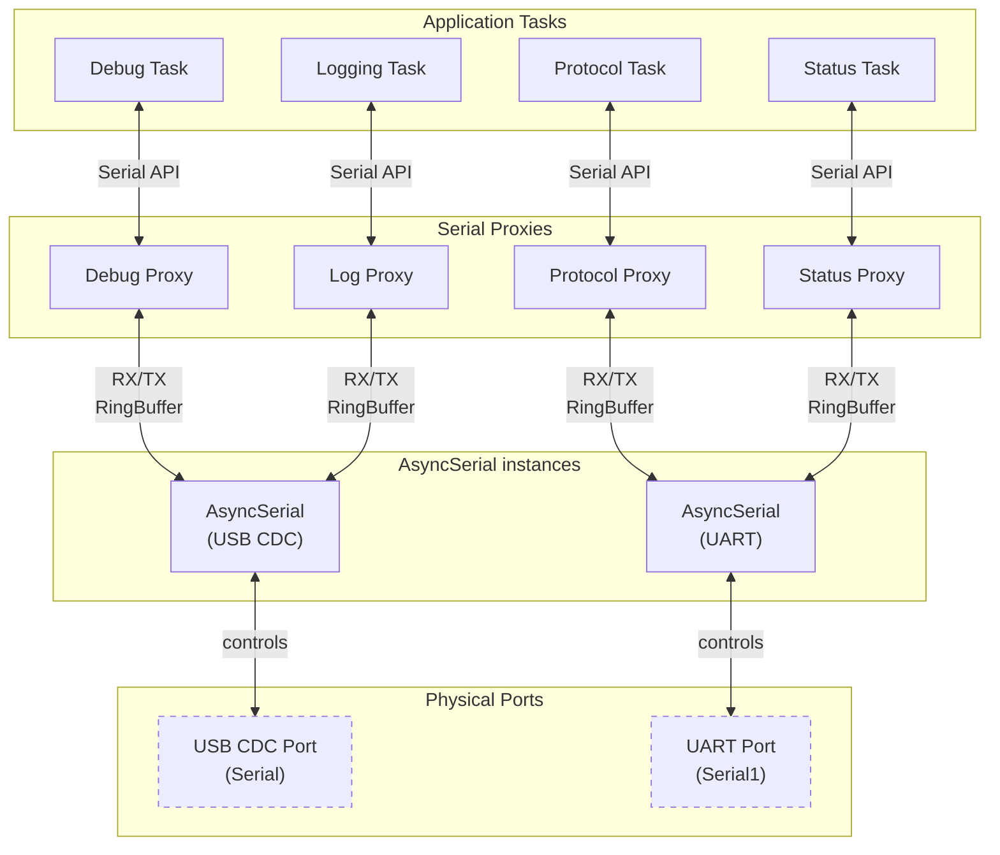

# AsyncSerial Documentation

## Introduction

`AsyncSerial` is a library designed to manage asynchronous and multi-proxy communication over a single hardware serial port on Arduino-compatible platforms. The primary goals are:

- Provide a **drop-in replacement for the Serial API**, ensuring existing code using `Serial` can be easily adapted.
- Allow **multiple logical streams** (`SerialProxy`) to share a single physical UART, each with its own buffers and configuration.
- Offer cooperative, non-blocking behavior for operations like `flush()` to prevent system stalls and improve responsiveness in multi-tasking or RTOS environments.

## Core Concepts

### Port Management
AsyncSerial takes complete ownership of a physical serial port (USB CDC or Hardware UART):
- The physical port should never be accessed directly after initialization
- All communication must go through AsyncSerial's proxy mechanism
- Multiple AsyncSerial instances can manage different physical ports
- Built-in mechanisms prevent race conditions on port access

### Drop-in Serial Replacement
Each SerialProxy provides a safe, thread-friendly replacement for direct Serial access:
- Implements the standard `Stream` interface
- Identical method signatures (`print`, `println`, `write`, `read`, `available`, etc.)
- Compatible with existing libraries that use Serial communication
- Same behavior for string formatting and special characters handling
- Thread-safe by design through internal buffering and state management

### Multiple Proxies
Each AsyncSerial instance supports up to 8 independent logical streams (proxies) sharing a single physical port:
- Each proxy operates independently with its own:
  - TX/RX buffers
  - Inter-message delays
  - Flush behavior
- Safe concurrent access from different tasks/threads
- Messages from different proxies are automatically multiplexed

### Thread Safety
Non-blocking collaboration between threads through `CooperativeLock`, ideal for:
- RTOS environments
- Cooperative multitasking
- Interrupt-driven architectures
- Ensures safe concurrent access without deadlocks

## Key Components

### 1. AsyncSerial
The main driver class managing the physical UART:
- Handles both hardware UART and USB CDC ports
- Multiplexes data between physical ports and logical proxies
- Maintains a state machine for serial operations
- Handles priority and timing

```cpp
// Create instances for different ports
AsyncSerial usbSerial(Serial);    // For USB CDC port
AsyncSerial uart1(Serial1);       // For hardware UART port
AsyncSerial uart2(Serial2);       // For another hardware UART port

// Initialization
usbSerial.begin(115200);  // Baudrate ignored for CDC
uart1.begin(115200);      // Configure UART
uart2.begin(9600);        // Different speeds possible

// Register proxies to specific ports
usbSerial.registerProxy(&debugProxy);
uart1.registerProxy(&protocolProxy);
```

### 2. SerialProxy
A virtual serial port implementing the `Stream` interface:
```cpp
SerialProxy<1024> console;  // 1KB buffer
SerialProxy<256> protocol;  // 256B buffer

// Use exactly like Serial:
console.println("Debug message");
protocol.print("AT+COMMAND\r\n");
```

### Illustration



### 3. RingBuffer & CooperativeLock
Thread-safe mechanisms ensuring non-blocking resource access
- `RingBuffer` between `AsyncSerial` and proxies (replicates the existing Serial ring buffer to each proxy)
- `CooperativeLock` to protect the `flush()` operation (ensures each proxy can flush its own buffer + ensures its content is actually sent to the physical serial, without race condition)

# AsyncSerial Documentation

## Drop-in Serial Compatibility

### Fully Compatible Methods
SerialProxy implements all standard Serial/Stream methods:
```cpp
// Basic I/O
int available()
int read()
int peek()
size_t write(uint8_t)
size_t write(const uint8_t*, size_t)
void flush()
int availableForWrite()

// String operations
String readString()
String readStringUntil(char terminator)
size_t readBytes(uint8_t *buffer, size_t length)
size_t readBytesUntil(char terminator, uint8_t *buffer, size_t length)

// Configuration
void setTimeout(unsigned long timeout)
unsigned long getTimeout()
void begin(unsigned long baud)
void begin(unsigned long baud, uint16_t config)
void end()
```

### Placeholder Methods
Some methods are implemented as no-ops for compatibility but don't provide functionality:
```cpp
bool find(char *target)                 // Always returns false
bool find(uint8_t *target, size_t)      // Always returns false
bool findUntil(char*, char*)            // Always returns false
bool findUntil(uint8_t*, size_t, char*, size_t) // Always returns false
float parseFloat()                      // Always returns 0.0
long parseInt()                         // Always returns 0
long parseInt(char skipChar)            // Always returns 0
```

### Key Differences from Serial

1. **Configuration Methods**
```cpp
// These don't actually configure the hardware
proxy.begin(9600);    // No effect - use the AsyncSerial instance's begin() instead
proxy.end();          // No effect - use the AsyncSerial instance's end() instead
```

2. **Blocking Operations**
```cpp
// These methods block but maintain system responsiveness by calling poll()
String response = proxy.readStringUntil('\n');  // Blocks with timeout
size_t count = proxy.readBytes(buffer, size);   // Blocks with timeout
```

3. **Buffer Management**
```cpp
// Each proxy has its own fixed-size buffer
SerialProxy<1024> proxy;  // Buffer size must be defined at compile time
```

## Thread Safety Considerations

### Thread-Safe Operations
```cpp
// Always thread-safe
proxy.flush()              // Protected by CooperativeLock
AsyncSerial::poll()        // Thread-safe when used as intended
```

### Non-Thread-Safe Operations
```cpp
// Must be called only during initialization
asyncSerial.begin()
asyncSerial.end()
asyncSerial.registerProxy()

// Must be synchronized externally if called from multiple threads (but all the point of this implementation is to allow one individual proxy per thread, so if you need to share a proxy between threads, you're probably doing something wrong)
proxy.write()
proxy.read()
proxy.available()
```

### Initialization Pattern
```cpp
// 0. Declare global instances
AsyncSerial usbSerial(Serial);
AsyncSerial uart(Serial1);
SerialProxy<1024> debugProxy;
SerialProxy<512> protocolProxy;

void setup() {
    // 1. Initialize AsyncSerial instances (non-thread-safe)
    usbSerial.begin(115200);
    uart.begin(115200);
    
    // 2. Register all proxies (non-thread-safe)
    usbSerial.registerProxy(&debugProxy);
    uart.registerProxy(&protocolProxy);
    
    // 3. After this, thread-safe operations can begin
    startTasks();  // If using RTOS
}
```

### RTOS Usage Notes
```cpp
// Dedicated polling task (recommended)
void serialPollTask(void*) {
    for (;;) {
        // Poll all active serial ports
        usbSerial.poll();
        uart.poll();
        vTaskDelay(pdMS_TO_TICKS(1));
    }
}

// Data handling task
void dataTask(void*) {
    for (;;) {
        if (debugProxy.available()) {
            String data = debugProxy.readString();
            // Process data...
        }
        vTaskDelay(pdMS_TO_TICKS(10));
    }
}
```

### Port Type Support

#### USB CDC Port
```cpp
AsyncSerial usbSerial(Serial);  // USB CDC port
usbSerial.begin(115200);        // Baudrate parameter is ignored
```

#### Hardware Serial Port
```cpp
AsyncSerial uart(Serial1);      // Hardware UART port
uart.begin(115200);             // Configures the baudrate
uart.begin(115200, SERIAL_8N1); // With additional configuration
```

### Best Practices for Thread Safety

1. **Initialization**
   - Complete all AsyncSerial and proxy setup before starting threads/tasks
   - Don't register new proxies after initialization

2. **Polling**
   - Use a dedicated high-priority task for polling in RTOS
   - Ensure consistent polling frequency
   - Don't call poll() from interrupt contexts

3. **Critical Sections**
   - Protect read/write operations when sharing a proxy between tasks
   - Keep critical sections short
   - Use RTOS primitives for synchronization if needed

## State Machine

The library operates in four states:

1. **IDLE**: Searching for work
   - Checks for incoming Serial data
   - Looks for proxies with pending transmissions

2. **READ**: Processing incoming data
   - Reads data in chunks
   - Distributes to all proxies

3. **WRITE**: Sending data
   - Respects inter-message delays
   - Handles one proxy at a time

4. **FLUSH**: Ensuring transmission
   - Blocks until complete
   - Enforces timeout

## Integration Examples

### With Existing Libraries
```cpp
// Using with libraries that expect Serial
AsyncSerial modbusSerial(Serial2);
SerialProxy<512> modbusProxy(10);  // 10ms delay

void setup() {
    modbusSerial.begin(9600);
    modbusSerial.registerProxy(&modbusProxy);
    
    // Use with ModbusMaster
    ModbusMaster node(1);
    node.begin(9600, modbusProxy);
}
```

### Multiple Port Management
```cpp
// Debug on USB CDC
AsyncSerial debug(Serial);
SerialProxy<1024> console;

// Protocol on UART1
AsyncSerial protocol(Serial1);
SerialProxy<512> protocolPort;

void setup() {
    // Initialize ports
    debug.begin(115200);
    protocol.begin(9600);
    
    // Register proxies
    debug.registerProxy(&console);
    protocol.registerProxy(&protocolPort);
    
    // Start RTOS tasks
    xTaskCreate(serialPollTask, "SerialPoll", 2048, NULL, 2, NULL);
    xTaskCreate(consoleTask, "Console", 2048, NULL, 1, NULL);
    xTaskCreate(protocolTask, "Protocol", 2048, NULL, 1, NULL);
}
```

## Best Practices

1. **Buffer Sizing**
   - Use power of 2 sizes for optimal memory alignment
   - Match size to expected data patterns:
     - Large for debug logs (1024-2048 bytes)
     - Small for status updates (128-256 bytes)
     - Medium for protocols (512 bytes)

2. **Inter-message Delays**
   - Use smaller delays for real-time data (1-5ms)
   - Use larger delays for human-readable output (20-50ms)
   - Consider protocol timing requirements

3. **Polling Frequency**
   - Call `poll()` in main loop or high-priority task
   - Balance responsiveness vs CPU usage
   - Consider using timer interrupts for consistent polling

4. **Error Handling**
   - Check buffer overflow conditions
   - Implement timeout handling for flush operations
   - Monitor proxy registration success

## Performance Considerations

1. **Memory Usage**
   - Each proxy consumes: 2 * BUFFER_SIZE + overhead
   - Static allocation prevents fragmentation
   - Configure buffer sizes based on available RAM

2. **CPU Usage**
   - State machine design minimizes busy-waiting
   - Chunk-based operations reduce interrupt overhead
   - Cooperative locking avoids priority inversion

3. **Latency**
   - Inter-message delays affect throughput
   - Polling frequency impacts responsiveness
   - Multiple proxies share bandwidth

## Appendix - `RingBuffer`

### Overview
The `RingBuffer` is a templated circular buffer implementation that provides efficient, fixed-size FIFO (First-In-First-Out) operations. Key characteristics:
- Template parameters for type and size
- No dynamic memory allocation
- Thread-safe for single producer/single consumer
- Overflow protection

### Implementation Details
```cpp
template<typename T, size_t SIZE>
class RingBuffer {
    T _buffer[SIZE];      // Fixed-size array
    size_t _readIndex;    // Next position to read
    size_t _writeIndex;   // Next position to write
    size_t _count;        // Current number of items
}
```

### Key Operations

#### Writing Data
```cpp
// Single item write
bool write(const T& data);

// Bulk write
bool write(const T* data, size_t length);
```
- Returns `false` if buffer would overflow
- Writing maintains FIFO order
- O(1) for single writes, O(n) for bulk writes

#### Reading Data
```cpp
// Destructive read
bool read(T& data);

// Non-destructive read
bool peek(T& data);
```
- Returns `false` if buffer is empty
- Reading preserves FIFO order
- Both operations are O(1)

### Usage Example
```cpp
RingBuffer<uint8_t, 256> buffer;  // 256-byte buffer

// Writing data
uint8_t data = 0x42;
if (!buffer.write(data)) {
    // Handle buffer full condition
}

// Bulk writing
uint8_t bulk[4] = {1, 2, 3, 4};
if (!buffer.write(bulk, 4)) {
    // Handle insufficient space
}

// Reading data
uint8_t readData;
if (buffer.read(readData)) {
    // Process readData
}

// Peeking at next item
uint8_t peekData;
if (buffer.peek(peekData)) {
    // Examine peekData without removing it
}
```

### Memory Efficiency
- Size must be defined at compile time
- Memory usage is exactly `sizeof(T) * SIZE + 3 * sizeof(size_t)`
- No memory fragmentation
- Indexes wrap around using modulo arithmetic

### Best Practices

1. **Size Selection**
```cpp
// Good - Power of 2 size for efficient modulo
RingBuffer<uint8_t, 256> goodBuffer;   // 256 = 2^8
RingBuffer<uint8_t, 512> alsoGood;     // 512 = 2^9

// Avoid - Non-power of 2 size
RingBuffer<uint8_t, 250> lessEfficient;  // Modulo is more expensive
```

2. **Overflow Handling**
```cpp
// Always check write operations
uint8_t data[8];
if (!buffer.write(data, sizeof(data))) {
    // 1. Skip data
    // 2. Wait and retry
    // 3. Flush buffer first
    // 4. Signal error condition
}
```

3. **Empty Condition Handling**
```cpp
// Check before each read
uint8_t data;
while (buffer.peek(data)) {  // Non-destructive check
    if (isValid(data)) {
        buffer.read(data);    // Actually remove the data
        process(data);
    } else {
        buffer.read(data);    // Discard invalid data
    }
}
```

### Integration with AsyncSerial

The RingBuffer is used internally by each SerialProxy for both TX and RX:
```cpp
template<size_t BUFFER_SIZE = 1024>
class SerialProxy : public SerialProxyBase {
private:
    RingBuffer<uint8_t, BUFFER_SIZE> _rxBuffer;  // Incoming data
    RingBuffer<uint8_t, BUFFER_SIZE> _txBuffer;  // Outgoing data
    //...
};
```

This provides:
- Independent buffers for each direction
- Configurable size per proxy
- Overflow protection
- Efficient memory usage

[Previous sections remain unchanged]

## Appendix - `CooperativeLock`

### Overview
The `CooperativeLock` is a lightweight synchronization primitive designed for cooperative multitasking. Unlike traditional mutex implementations, it:
- Never blocks completely
- Allows work to be done while waiting
- Uses atomic operations for thread safety
- Is template-based for type safety

### Core Implementation
```cpp
template<typename T>
class CooperativeLock {
public:
    using PollCallback = std::function<void()>;
    
    bool acquire(T* owner, PollCallback poll) {
        T* expected = nullptr;
        while (!_owner.compare_exchange_weak(expected, owner)) {
            expected = nullptr;
            poll();  // Do useful work while waiting
        }
        return true;
    }

    void release(T* owner) {
        T* expected = owner;
        _owner.compare_exchange_strong(expected, nullptr);
    }

    bool isOwnedBy(T* owner) const { 
        return _owner.load() == owner; 
    }

private:
    std::atomic<T*> _owner;
};
```

### Key Features

#### 1. Type Safety
```cpp
// Lock can only be used with the specified type
CooperativeLock<SerialProxyBase> proxyLock;    // For proxies
CooperativeLock<Task> taskLock;                // For tasks
```

#### 2. Atomic Operations
- Uses `std::atomic` for thread-safe operations
- `compare_exchange_weak` for lock attempts
- `compare_exchange_strong` for release
- `load` for ownership checks

#### 3. Cooperative Nature
```cpp
// Instead of blocking:
lock.acquire(&proxy, []() {
    // Do useful work while waiting:
    AsyncSerial::getInstance().poll();
});
```

### Usage in AsyncSerial

#### 1. Flush Protection
```cpp
// In AsyncSerial::flush
bool AsyncSerial::flush(SerialProxyBase* proxy) {
    // Take the lock, keep polling while waiting
    _flushLock.acquire(proxy, [this]() { 
        poll(); 
    });

    // Lock acquired, do the flush operation
    _state = State::FLUSH;
    
    // ... flush operation ...

    // Release the lock
    _flushLock.release(proxy);
    return true;
}
```

#### 2. Custom Integration Example
```cpp
class CustomProxy : public SerialProxyBase {
private:
    CooperativeLock<CustomProxy> _txLock;
    AsyncSerial& _serial;
    
    bool sendMessage(const String& msg) {
        // Try to acquire lock with custom work
        _txLock.acquire(this, [this]() {
            // Process incoming data while waiting
            processRxBuffer();
            // Keep serial operations moving
            _serial.poll();
        });
        
        // Lock acquired, send message
        bool result = doSendMessage(msg);
        
        _txLock.release(this);
        return result;
    }
};
```

### Best Practices

#### 1. Keep Critical Sections Short
```cpp
// Good - Short critical section
lock.acquire(owner, callback);
doQuickOperation();
lock.release(owner);

// Bad - Long critical section
lock.acquire(owner, callback);
doLengthyOperation();  // Others wait too long
lock.release(owner);
```

#### 2. Useful Work in Callbacks
```cpp
// Good - Productive waiting
lock.acquire(&proxy, [&serial]() {
    processIncoming();
    updateStatus();
    serial.poll();
});

// Bad - Busy waiting
lock.acquire(&proxy, []() {
    delayMicroseconds(10);  // Just wastes CPU
});
```

#### 3. Always Release
```cpp
// Good - RAII-style usage
class LockGuard {
    CooperativeLock<T>& _lock;
    T* _owner;
public:
    LockGuard(CooperativeLock<T>& lock, T* owner, 
              std::function<void()> poll) 
        : _lock(lock), _owner(owner) {
        _lock.acquire(owner, poll);
    }
    ~LockGuard() {
        _lock.release(_owner);
    }
};
```

### Performance Considerations

1. **Memory Impact**
   - Single atomic pointer per lock
   - No additional memory allocation
   - Cache-friendly single-word storage

2. **CPU Usage**
   - No spinlock busy-waiting
   - Useful work during contention
   - Lock-free atomic operations

3. **Contention Handling**
   - No priority inversion
   - No thread blocking
   - Fair access through polling

### Common Use Cases

1. **Network Message Queue**
```cpp
AsyncSerial uart(Serial1);
CooperativeLock<MessageQueue> queueLock;

class MessageQueue {
    Queue<Message> highPriorityQueue;
    Queue<Message> lowPriorityQueue;

public:
    bool sendMessage(const Message& msg) {
        queueLock.acquire(this, [this]() {
            // Process high-priority messages while waiting
            if (highPriorityQueue.available()) {
                processHighPriorityMessage();
            }
            handleBackgroundTasks();
        });

        // Now safely add to queue
        lowPriorityQueue.push(msg);
        queueLock.release(this);
        return true;
    }
};
```

2. **Sensor Data Collection**
```cpp
AsyncSerial debug(Serial);
CooperativeLock<SensorManager> sensorLock;

class SensorManager {
    CircularBuffer<SensorData> buffer;
    BME280 tempSensor;
    LSM6DS3 imuSensor;

public:
    bool writeSensorData(const SensorData& newData) {
        sensorLock.acquire(this, [this]() {
            // Keep reading other sensors while waiting
            tempSensor.readTemperature();  // Quick I2C read
            imuSensor.readAcceleration();  // Keep IMU data fresh
            updateMovingAverage();         // Process existing data
        });

        buffer.push(newData);
        sensorLock.release(this);
        return true;
    }
};
```

3. **UI Event Handler**
```cpp
AsyncSerial debug(Serial);
CooperativeLock<UIManager> uiLock;

class UIManager {
    TouchScreen touch;
    EventQueue uiEvents;

public:
    bool updateDisplay(const ScreenUpdate& update) {
        uiLock.acquire(this, [this]() {
            // Handle touch events while waiting
            if (touch.available()) {
                processTouchEvent();
            }
            // Update LED indicators
            updateStatusLEDs();
            // Check button states
            scanButtons();
        });

        display.update(update);
        uiLock.release(this);
        return true;
    }
};
```

Each example shows:
- Different types of useful work during lock waiting
- Mixing fast operations (sensor reads, checks) with calculations
- Safety monitoring and background tasks
- Data processing and state updates
- Multiple subsystem coordination

The key is to use the waiting time to perform quick, useful operations that:
- Don't require the locked resource
- Keep the system responsive and safe
- Maintain data freshness
- Process background tasks
- Monitor system health
